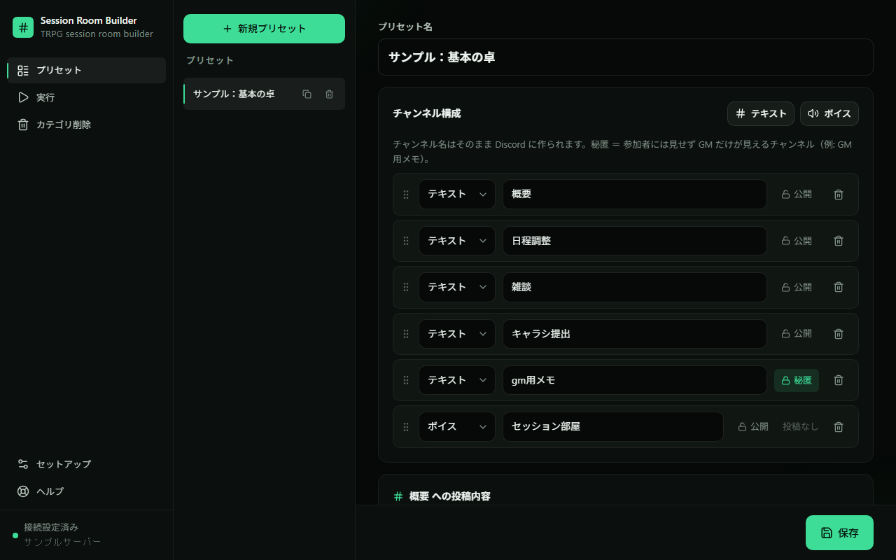
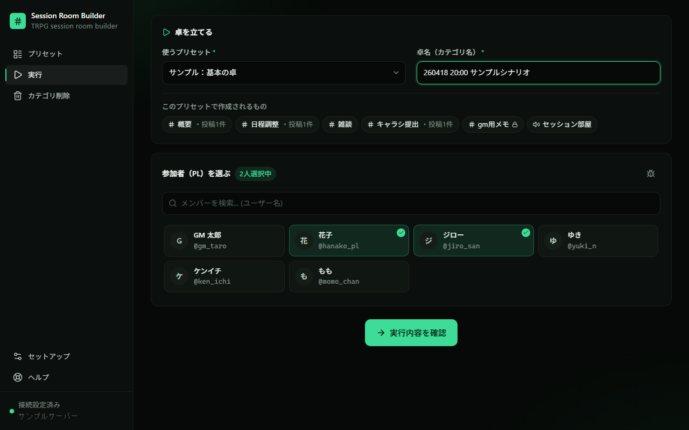
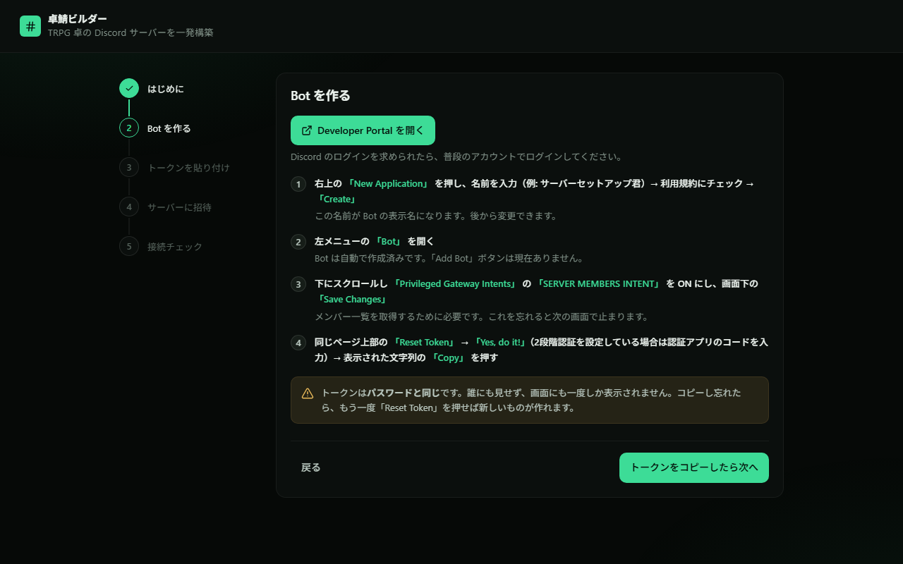

# 卓鯖ビルダー（たくさばビルダー）

TRPG の卓（セッション）ごとに必要な Discord チャンネル一式を、プリセットから一発で作って、終わったらまとめて片付けるデスクトップアプリ（Windows / Mac）

[](https://github.com/reverinudog/takusaba-builder/releases/latest)
[](LICENSE)

## こんな人向け

- セッションのたびに「概要」「日程調整」「雑談」「キャラシ提出」…を手で作っている GM
- 卓ごとに「その卓の人だけが見える場所」をさっと用意したい人
- 終わった卓のチャンネルが残り続けて、サーバーが散らかってきた人

## できること

1. **プリセットを作る** — 卓で毎回使うチャンネル構成と、最初に投稿する案内文・画像をプリセットとして登録
2. **卓を立てる** — プリセット・卓名・参加者を選ぶだけで、参加者だけが見えるカテゴリとチャンネルを一括作成（案内文も自動投稿）
3. **片付ける** — 終わった卓はカテゴリごとチャンネルをまとめて削除




## ダウンロード

[Releases ページ](https://github.com/reverinudog/takusaba-builder/releases/latest) から最新版をダウンロードしてください。

| OS | ファイル |
|---|---|
| Windows | `TakusabaBuilder-Setup-x.x.x.exe`（迷ったらこれ） |
| Mac | `TakusabaBuilder-x.x.x-mac.dmg` |

## インストール

### Windows

1. ダウンロードした `Setup-x.x.x.exe` を実行
2. 「WindowsによってPCが保護されました」と出たら **「詳細情報」→「実行」**
3. デスクトップにできた「卓鯖ビルダー」ショートカットから起動

### Mac

1. `.dmg` を開いてアプリを `Applications` にドラッグ
2. 初回は「開発元を検証できない」と出るので、**Finder でアプリを右クリック →「開く」**

## はじめての設定（約5分）

初回起動時に、画面の案内（セットアップウィザード）がそのまま設定まで導きます。やることは:

1. [Discord Developer Portal](https://discord.com/developers/applications) で Application を作成
2. 「Bot」ページで **SERVER MEMBERS INTENT** を ON にし、「Reset Token」でトークンをコピー
3. アプリが表示する招待リンクから、Bot を対象サーバーに追加



> **トークンはパスワードと同じです。人に見せないでください。**

## 使い方

### 1. プリセットを作る

「プリセット」タブで、卓に必要なチャンネル（名前・テキスト/ボイス・秘匿）と、作成時に自動投稿する文章や画像を登録します。**秘匿**チャンネルは参加者には見えず GM だけが見えるチャンネルです（GM用メモなどに）。

### 2. 卓を立てる（実行）

「実行」タブでプリセット・卓名（カテゴリ名）・参加者（PL）を選んで実行すると、参加者だけが見えるカテゴリとチャンネルが作られ、登録した案内文が自動投稿されます。参加者を選ばない場合、Bot と管理者だけが見えるカテゴリになります（あとから Discord 側で権限を追加できます）。

### 3. 片付ける（カテゴリ削除）

「カテゴリ削除」タブで、終わった卓のカテゴリを選んで削除します。配下のチャンネル（ログを含む）もすべて消えるので、残したいログは先にコピーしてください。

## よくある質問

- **メンバー一覧が空 / 取得できない** → Developer Portal → Bot → SERVER MEMBERS INTENT が ON か確認して Save Changes。アプリの「ヘルプ」→「診断を実行」でも確認できます
- **チャンネル作成に失敗する** → Bot の権限不足です。診断で不足権限を確認し、招待リンクをもう一度開くと権限が更新されます
- **卓を立てたのに参加者から見えない** → 実行時に参加者を選んだか確認。選び忘れた場合は Discord でそのカテゴリを右クリック →「カテゴリの編集」→「権限」からメンバーを追加
- **招待先の一覧にサーバーが出ない** → そのサーバーであなたに「管理者」または「サーバー管理」権限が必要です
- **トークンを他人に見られた / 漏れたかも** → Developer Portal → Bot → Reset Token で無効化し、アプリの「セットアップ」から新しいトークンを保存
- **Mac で「開発元を検証できないため開けません」と出る** → Finder で右クリック →「開く」。それでもダメなら システム設定 → プライバシーとセキュリティ →「このまま開く」
- **セキュリティソフトに止められる** → アプリを「許可」に設定してください。Discord 以外とは通信しません
- **別のパソコンに移したい** → アプリの「ヘルプ」→「データフォルダを開く」で開くフォルダごとコピーしてください

## データとプライバシー

- 設定（Bot トークン）とプリセットはこの PC 内にのみ保存されます:
  - Windows: `%APPDATA%\TakusabaBuilder\data`
  - Mac: `~/Library/Application Support/TakusabaBuilder/data`
- このアプリが通信するのは **Discord の API だけ**です。データが外部サーバーに送られることはありません
- データフォルダにはトークンが含まれます。**他人に渡さないでください**

## 開発者向け

<details>
<summary>開発・ビルド手順</summary>

### 要件

- Node.js 24

### セットアップ

```sh
npm install
cd web && npm install
```

### 開発

```sh
npm run dev            # ts-node サーバー(:3000) + Vite dev サーバー
npm start              # サーバーのみ（ビルド済み web/dist を配信）
npm run electron:dev   # Electron ウィンドウで起動（開発モード、データはリポジトリの data/）
```

### 配布物の作成

```sh
npm run dist:win   # Windows インストーラ → release/TakusabaBuilder-Setup-*-x64.exe / -arm64.exe
npm run dist:mac   # macOS dmg/zip（Mac 上でのみ動作）
```

GitHub Actions（`.github/workflows/release.yml`）が `v*` タグ push または手動実行で Windows/Mac 両方の配布物をビルドし、タグ時は GitHub Release に添付します。

### ディレクトリ構成

```
src/              Express サーバー（Discord REST 操作、セットアップ API）
electron/         Electron メインプロセス
web/              React + Vite フロントエンド
build-resources/  アイコン
scripts/          make-icon.cjs
build/            esbuild バンドル出力（gitignore）
release/          配布物（gitignore）
```

- サーバー依存はすべて esbuild で `build/` にバンドルされるため `dependencies` は空です
- `.env`（`DISCORD_BOT_TOKEN` / `GUILD_ID`）は後方互換で読み込まれますが、`data/config.json`（gitignore）が優先です

</details>

## ライセンス

MIT
